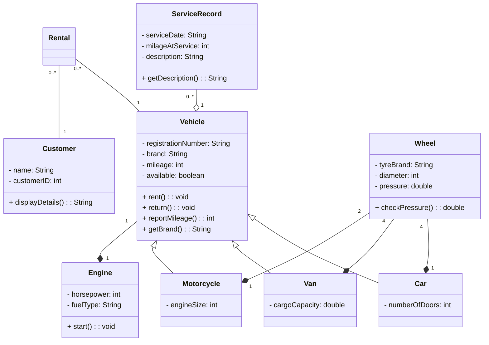

# UML Pratice (First ever) - guided with CHATGPT

## UML DESIGN

```mermaid
classDiagram
    class Vehicle {
        - registrationNumber: String
        - brand: String
        - mileage: int
        - available: boolean
        + rent(): void
        + return(): void
        + reportMileage(): int
        + getBrand(): String
    }
    class Car {
        - numberOfDoors: int
    }

    class Van {
        - cargoCapacity: double
    }

    class Motorcycle {
        - engineSize: int
    }

    class Engine {
        - horsepower: int
        - fuelType: String
        + start(): void
    }

    class Customer {
        - name: String
        - customerID: int
        + displayDetails(): String
    }

    class Wheel {
        - tyreBrand: String
        - diameter: int
        - pressure: double
        + checkPressure(): double
    }

    class ServiceRecord {
        - serviceDate: String
        - milageAtService: int
        - description: String
        + getDescription(): String
    }

    class Rental {
    }

%% relationships
    Vehicle <|-- Car
    Vehicle <|-- Van
    Vehicle <|-- Motorcycle
    Vehicle "1" --* "1" Engine
    ServiceRecord "0..*" --o "1" Vehicle
    Wheel "4" --* "1" Car
    Wheel "4" --* "1" Van
    Wheel "2" --* "1" Motorcycle
    Rental "0..*" -- "1" Vehicle
    Rental "0..*" -- "1" Customer


```