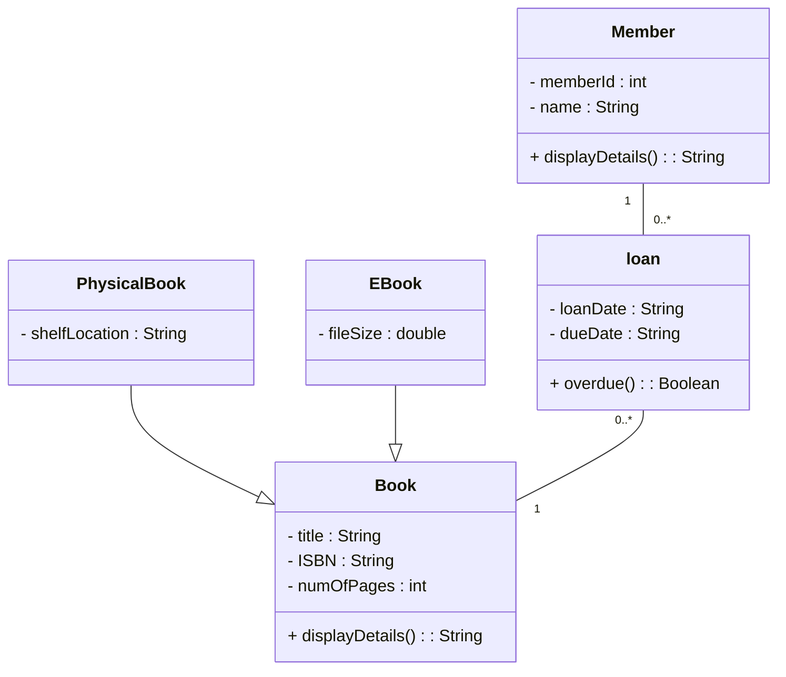

# UML Day 1 practice - Unguided Excersize

### specifications: 

A library stores **Books**.

Each `Book` has:
- title
- ISBN
- number of pages
- a method to display its details

There are two types of books:
- `PhysicalBook`, which has a shelf location
- `EBook`, which has a file size

The library has **Members**.

Each `Member` has:
- member ID
- name
- a method to display their details

A member can make **0 or many Loans**.

Each `Loan`:
- belongs to exactly **1 Member**
- is for exactly **1 Book**
- has a loan date
- has a due date
- can calculate whether the book is overdue

A `Book` can have **0 or many Loans** over its lifetime.

## Task

Create a UML class diagram for the system.

Decide yourself:

- What classes are needed
- What attributes each class needs
- What methods each class needs
- Which relationships are:
    - Association
    - Aggregation
    - Composition
    - Inheritance
- The multiplicity of each relationship

## UML Diagram

 

### Error log 

- Confusing composition with inheritance
- Confusing association with inheritance
- Class name capitalisation
- Remembering the IS-A test